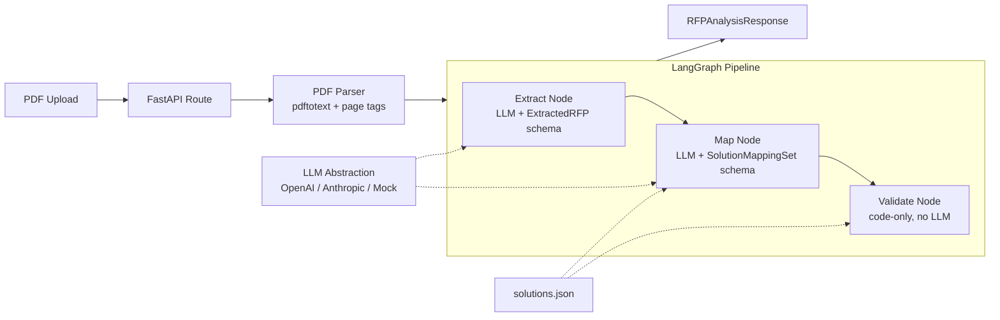

# RFP Analyzer — Design Note

## Overview

A lightweight service that ingests data-center / colocation RFPs, extracts structured information, and maps the resulting requirements to a catalog of Equinix sales plays. The system is delivered as a FastAPI service backed by a three-stage LangGraph pipeline (extract → map → validate), with an LLM-provider abstraction that keeps model choice swappable. The design favors deterministic, auditable output over expansive coverage: every claim in the mapping output traces back to a stable requirement ID extracted from the source PDF, and that grounding is verified in code rather than trusted from the model.

## Problem framing

Two RFPs were provided to test differentiation:

- **CCAC** (Community College of Allegheny County) — a colocation migration RFP. Its weighted scoring matrix places 25% on networking categories (BGP, cross-connects, cloud on-ramps), and requirements include BGP peering with customer-owned /16 advertisement, customer ASN support, and named cloud on-ramps (AWS / Azure / GCP). This is a **networking + hybrid-cloud** RFP.
- **WHEDA** (Wisconsin Housing & Economic Development Authority) — a disaster-recovery siting RFP. Its mandatory list includes armed guards, person-trap entry, NOC/SOC on site, 30 kW per cabinet with 1600 + 400 ton cooling, and NDAA compliance alongside SOC 2 / HIPAA / PCI DSS. This is a **security + compliance** RFP.

The assignment brief listed four illustrative solution categories. The provided `equinix_sales_plays_offerings.pdf`, however, defines **six** plays, each with a description and four signal-statements (Hybrid Multicloud Enablement, Digital Infrastructure Expansion, Interconnection & Ecosystem, Edge & Low-Latency Deployment, Security & Resilience, AI / High-Performance Compute). The system uses the real six, loaded from `solutions.json` at startup. New plays can be added by editing the JSON — no code changes.

The system's headline output is a comparison view showing how the two RFPs score differently against the same catalog. If the contrast doesn't surface clearly, the system has failed its primary task regardless of code quality.

## Architecture

The pipeline is intentionally linear. Branching (retry on validation failure, human-review routing) is straightforward to add as a conditional edge from the validate node, but is deferred until the basic flow is validated against real data.

## Components and stages

**PDF parsing.** `pdftotext -layout` produces page-tagged text (markers like `[Page 3]`) that flows into the extraction prompt. Both provided RFPs are text-extractable; OCR is not wired up but the parser interface accepts the same `(text, page_count)` tuple so an OCR fallback slots in without touching downstream code.

**Extraction service (`extraction_service.py`).** Single LLM call per RFP using OpenAI's Responses API with `text_format=ExtractedRFP`. The schema captures both granular `requirements[]` (each with a stable ID, theme enum, priority enum, source page, and verbatim excerpt) and typed sub-models (power, cooling, network, physical security, compliance, etc.) for high-signal domains. Sub-models are views; `requirements[]` is the canonical source of truth.

**Mapping service (`mapping_service.py`).** Single LLM call producing a `SolutionMappingSet` — one `SolutionMapping` per catalog play, each containing a signal-by-signal assessment, a confidence label (HIGH / MEDIUM / LOW / NONE), a 0–1 score, and a rationale. The service is deliberately narrow: it loads the catalog, builds the prompt, calls the LLM, returns the parsed mappings. It does not validate.

**Validation service (`validation_service.py`).** Pure-code checks against the LLM's mapping output. Two classes of check: (1) **grounding** — every `REQ-` ID cited in any signal assessment must exist in `ExtractedRFP.requirements`; (2) **catalog coverage** — each play in the loaded catalog appears exactly once, no unknown play names. Produces a `ValidationReport` that travels through to the API response.

**LLM abstraction (`llm/`).** An abstract `LLMProvider` with a single method, `complete_structured(system, user, response_model)`. Concrete implementations wrap OpenAI's Responses API and Anthropic's tool-use; a `MockProvider` returns canned fixtures for tests. Provider is selected via environment variable. The abstraction has no FastAPI dependency and lives in its own folder, per the requirement that LLM services be plug-and-play.

**FastAPI service (`app/`).** Endpoints: `POST /analyze` (PDF upload, end-to-end), `POST /extract` (PDF only), `POST /map` (extraction JSON only), `POST /compare` (multiple analyses), `GET /categories`, `GET /health`. Endpoints are `async def` and await the LLM calls directly — adequate for 13-page RFPs (10–30s end-to-end). FastAPI's dependency injection wires the LLM provider, which lets tests swap in `MockProvider` cleanly.

## Key design decisions

**Two-stage pipeline, extraction descriptive and mapping interpretive.** A single combined LLM call would be simpler, but extraction and mapping have different failure modes (extraction can miss facts; mapping can misjudge fit) and different schemas. Separating them allows the mapper to operate on structured data rather than re-parsing prose, makes the requirement-ID grounding check possible, and lets new catalogs be added without retraining the extraction prompt. The cost is a second LLM call per RFP.

**Granular `requirements[]` with stable IDs as the canonical field.** A naive schema would put `networking: str` on the model and let the LLM stuff a paragraph in. That collapses signal into prose the mapper must re-parse, makes evidence unverifiable, and produces variance across runs. Modeling each ask as a typed `Requirement` with an ID, theme, priority, and source span unlocks programmatic grounding validation, deterministic citation, and the comparison view that surfaces RFP differentiation.

**Themes and priorities as enums driven by lexical cues.** The extraction prompt assigns themes (`network_internet`, `physical_security`, …) from a closed enum and priorities (`mandatory`, `preferred`, `optional`) based on lexical cues (`must`/`shall` → mandatory, `should`/`preferred` → preferred). This is more reliable than asking the LLM to judge "how important does this sound" and matches how procurement professionals actually write. The themes drive everything downstream: signal-statement matching in the mapping prompt, theme-weighted scoring, the comparison view.

**Signal-by-signal assessment in the mapping schema.** Each sales play has four signal-statements. The mapping schema requires the LLM to produce a `SignalAssessment` for each signal (MET / PARTIAL / NOT_MET) with cited requirement IDs, before assigning confidence. A Pydantic `model_validator` enforces that NOT_MET cannot cite evidence and MET / PARTIAL must — closing the two most common LLM failure modes for this task. The free-text `supporting_evidence: str` field from the original schema would have allowed neither structural enforcement nor grounding checks.

**Confidence label *and* numeric score, with a consistency validator.** The label maps to a human-readable rubric; the score lets downstream code rank, sort, and threshold. A Pydantic validator catches inconsistency (e.g., confidence HIGH with score 0.3) and rejects it before it reaches the response. The bounds overlap loosely between adjacent tiers to avoid excessive retries on edge cases.

**Validation as a separate graph node, not part of the mapping service.** Validation is deterministic code, not LLM judgment, so it shouldn't share an interface with the mapper. As a separate node, it gets its own log line, can be re-run in isolation against stored mapping output, and can later branch the graph (e.g., conditional edge to a retry node or a human-review terminal) without touching the mapper.

**Pluggable catalog via `solutions.json`.** Hardcoding the six plays in Python would couple the schema to a specific catalog version and prevent adding plays without code changes. The catalog is loaded at startup and rendered into the system prompt. Adding a new play requires editing the JSON; the validator, prompt, and ranking machinery all flex automatically.

**System / user prompt split.** Stable instructions (rubric, theme list, catalog) live in the system prompt; only the per-RFP payload varies in the user message. This unlocks prompt caching — on Anthropic, marking the system prompt as cached cuts per-call cost meaningfully once the system processes more than a couple of RFPs. The cache key is the system prompt's byte content; we keep it deterministic (no timestamps, no per-call interpolation).

## Scaling

The system as built handles one RFP at a time, end-to-end in ~15–40 seconds. Scaling to a corpus of thousands of RFPs requires a few additions, each of which the current architecture supports cleanly:

**Asynchronous job processing.** Replace the synchronous `/analyze` endpoint with a job-queue pattern: client POSTs the PDF, receives a job ID, polls `/jobs/{id}` for status and result. Workers (Celery + Redis, RQ + Redis, or AWS SQS + ECS) consume jobs and run the same `RFPProcessGraph`. The graph is already stateless, so worker scale-out is horizontal.

**Storage layer.** Raw PDFs in object storage (S3), parsed text and `RFPAnalysisResponse` JSON in a document store (Postgres + JSONB or DynamoDB), keyed by a content hash of the PDF. Re-running an analysis with the same input becomes a cache hit; comparing across a historical corpus becomes a database query.

**Prompt caching savings compound.** With dozens of RFPs per day, the system prompt for extraction (~1.2k tokens) and mapping (~1.5k tokens) being cached on every call meaningfully changes the cost profile — by an order of magnitude on Anthropic's pricing for the system-prompt portion.

**Long-document chunking.** Both provided RFPs are 13 pages and fit in one LLM call. For longer RFPs (50+ pages), the extraction stage would chunk on section boundaries (Roman numerals or `## Section` markers), extract per-chunk, then merge with deduplication on requirement text. The `Requirement.id` numbering would need to be assigned in the merge step rather than during per-chunk extraction.

**Retrieval-augmented mapping.** Once a corpus exists, prior `(RFP, mapping)` pairs can be embedded and queried during mapping to give the LLM examples of similar RFPs and how they were mapped. This is the obvious place to use a vector store (pgvector or Pinecone). Out of scope for a corpus of two.

**Evaluation harness.** A `pytest` suite with a small gold set (frozen expected top-plays for known RFPs) catches regressions when prompts or models change. For a real deployment, this evolves into a labeled dataset and continuous regression testing on every prompt or model bump.

**Observability.** Per-stage latency, schema-validation failures, grounding-violation rates, and confidence-distribution shifts are the metrics worth tracking. Each is a one-line addition at the node boundary.

## Documented assumptions and out-of-scope

The system makes a few assumptions worth surfacing. PDFs are assumed text-extractable; OCR is not wired up (verified safe for the two provided RFPs). The API is unauthenticated; in production an API-key middleware or OAuth layer plugs in at the FastAPI router level. Both RFPs reference attachments not provided (WHEDA's Cost Sheet xlsx, CCAC's MSA and Form B) — the extractor surfaces these in `referenced_attachments` rather than silently treating partial data as complete. The Anthropic provider is implemented in the abstraction but the demo runs against OpenAI's Responses API. The validator surfaces grounding failures but does not retry — retry-on-failure is a reasonable next step but is intentionally deferred because the most common cause (LLM cites an ID extraction missed) is better addressed in extraction than by re-rolling the mapper.

The biggest deliberate omission is automated catalog-signal coverage checking: the validator enforces that each play is scored once, but does not yet enforce that each play's four signal-statements all receive an assessment. The Pydantic schema requires at least one. This check belongs in the validator and is the natural next addition once the rest is stable.
